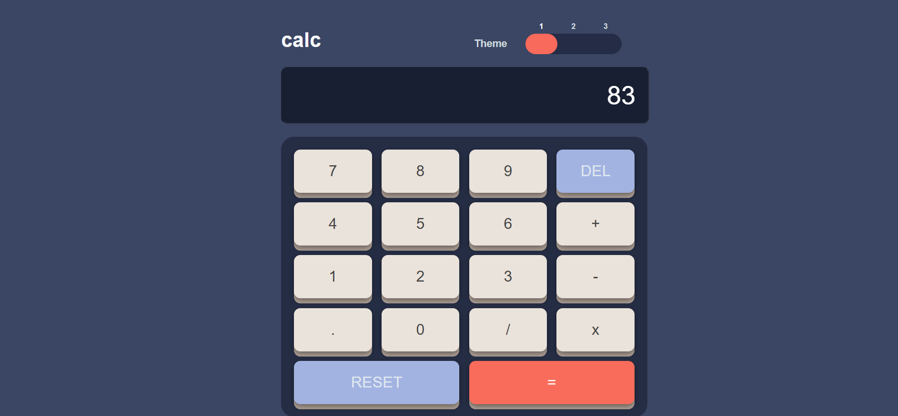
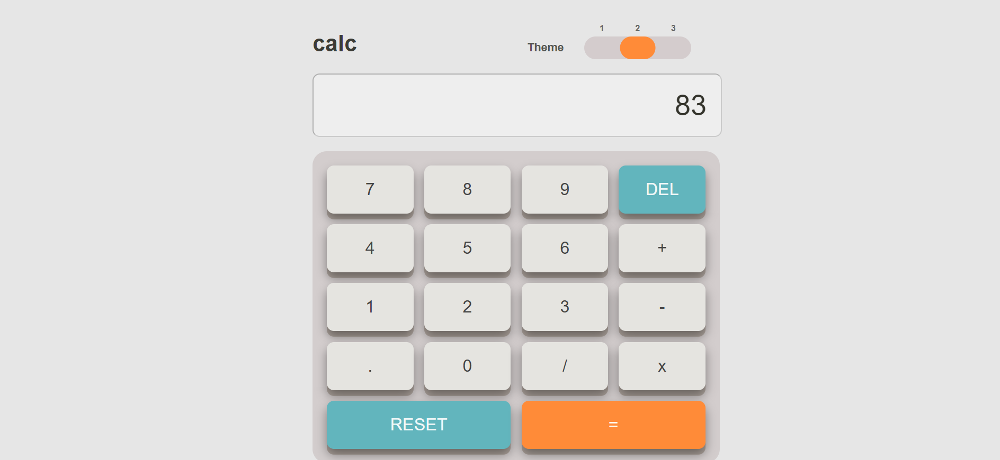
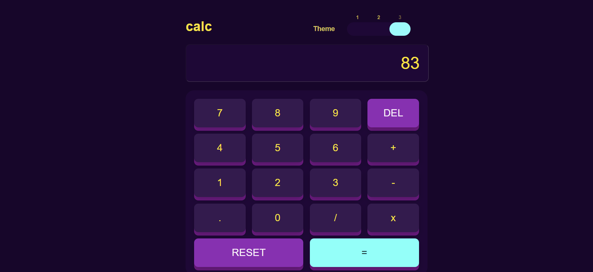

# Frontend Mentor - Calculator app solution

This is a solution to the [Calculator app challenge on Frontend Mentor](https://www.frontendmentor.io/challenges/calculator-app-9lteq5N29). Frontend Mentor challenges help you improve your coding skills by building realistic projects. 

## Table of contents

- [Overview](#overview)
  - [The challenge](#the-challenge)
  - [Screenshot](#screenshot)
  - [Links](#links)
- [My process](#my-process)
  - [Built with](#built-with)
  - [Continued development](#continued-development)
- [Author](#author)

## Overview

### The challenge

Users should be able to:

- See the size of the elements adjust based on their device's screen size
- Perform mathmatical operations like addition, subtraction, multiplication, and division
- Adjust the color theme based on their preference
- **Bonus**: Have their initial theme preference checked using `prefers-color-scheme` and have any additional changes saved in the browser

### Screenshot

### Links

- Solution URL: [https://github.com/FatimaAliakberli/calculator-app-main]
- Live Site URL: [https://calculator-app-main-rosy.vercel.app/]

## My process

### Built with

- HTML
- CSS custom properties
- Javascript

### Continued development

It was one of my beginner projects. I mainly used HTML, Javascript and CSS. It was great experience to learn how to make themes using those programming languages. 

For my next projects, I will consider using much easier ways to provide themes, rather than styling each of them with CSS.

## Author

- Website - [https://github.com/FatimaAliakberli]
- Frontend Mentor - [https://www.frontendmentor.io/profile/FatimaAliakberli]

